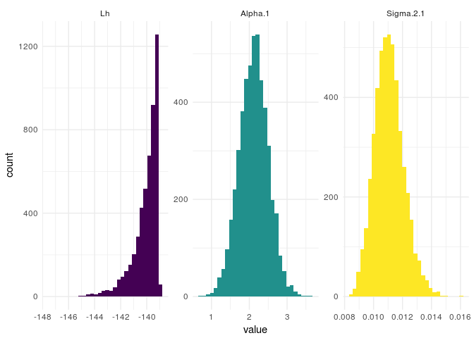

BTprocessR
================
H. Ferguson-Gow
7 February 2018

-   [Introduction](#introduction)
-   [Loading, summarising and plotting posteriors](#loading-summarising-and-plotting-posteriors)

Introduction
============

BTprocessR is an R package that provides a set of tools to help with the analysis of the output of the various MCMC models in [BayesTraits](http://www.evolution.rdg.ac.uk/BayesTraitsV3.0.1/BayesTraitsV3.0.1.html). The package includes functions for visualising the posterior distribtuion of the estimated parameters, summarising and plotting posterior distributions of phylogenies (resulting from rate-variable and/or reversible jump local transformation (RJLT) models, summarising inferred rate scalars for each node and branch in a tree, and identifying and plotting rate shifts. Currently the package only deals with the output of analyses of continuous traits, with functions for the various discrete trait analyses coming soon.

Loading, summarising and plotting posteriors
============================================

A log file containing an MCMC posterior (by default BayesTraits appends these files with .Log.txt) can be parsed with the function loadPosterior. This function returns a tibble with each sample taken during the MCMC chain, one per row. Printing this object returns some simple summary statistics for each parameter.

``` r
library(BTprocessR)

post <- loadPosterior(system.file("extdata", "marsupials_brownian.txt.Log.txt", package = "BTprocessR"))

print(post)
```

    ## Posterior of  5000  samples
    ## 
    ##   Parameter   Median     Mean     Mode    SD
    ## 1        Lh -140.082 -139.769 -139.302 1.009
    ## 2   Alpha.1    2.115    2.124    2.168 0.385
    ## 3 Sigma.2.1    0.011    0.011    0.011 0.001
    ## 
    ## # A tibble: 5,000 x 5
    ##    Iteration    Lh Tree.No Alpha.1 Sigma.2.1
    ##  *     <dbl> <dbl>   <dbl>   <dbl>     <dbl>
    ##  1   1001000  -139    1.00    2.12   0.0107 
    ##  2   1002000  -139    1.00    2.28   0.0115 
    ##  3   1003000  -140    1.00    2.63   0.0104 
    ##  4   1004000  -141    1.00    2.58   0.0124 
    ##  5   1005000  -141    1.00    2.54   0.0126 
    ##  6   1006000  -140    1.00    2.32   0.00993
    ##  7   1007000  -139    1.00    2.26   0.0103 
    ##  8   1008000  -139    1.00    2.18   0.0109 
    ##  9   1009000  -142    1.00    1.51   0.00942
    ## 10   1010000  -142    1.00    2.53   0.0131 
    ## # ... with 4,990 more rows

It is also possible to plot histograms of each of the parameters present in the posterior.

``` r
plot(post)
```



<!-- ## Contents -->
<!-- 1. Introduction -->
<!-- 2. Loading, visualising and assessing posteriors -->
<!-- 3. Loading and visualising posterior samples of trees -->
<!-- 4. Post-processing rate-variable and reverse-jump local transformation models -->
<!-- + Postprocessing *.Varrates.txt files -->
<!-- + Finding rate shifts -->
<!-- + Visualising rate shifts  -->
``` r
summary(cars)
```

    ##      speed           dist       
    ##  Min.   : 4.0   Min.   :  2.00  
    ##  1st Qu.:12.0   1st Qu.: 26.00  
    ##  Median :15.0   Median : 36.00  
    ##  Mean   :15.4   Mean   : 42.98  
    ##  3rd Qu.:19.0   3rd Qu.: 56.00  
    ##  Max.   :25.0   Max.   :120.00


