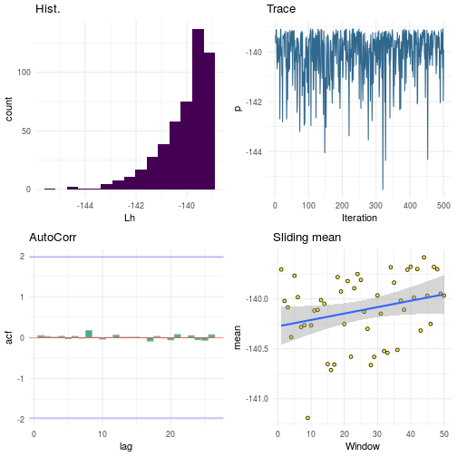
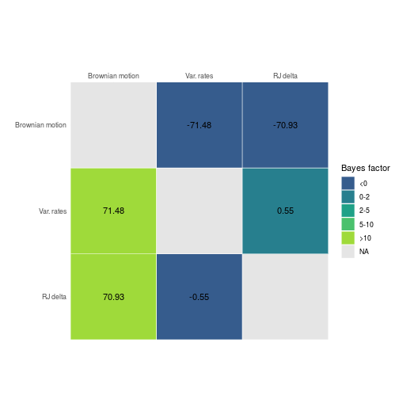

# Introduction

__NOTE__ This package is still under construction. Some functions may be absent, or non-functional in their current state.

BTprocessR is an R package that provides a set of tools to help with the analysis of the output of the various MCMC models in [BayesTraits](http://www.evolution.rdg.ac.uk/BayesTraitsV3.0.1/BayesTraitsV3.0.1.html). The package includes functions for visualising the posterior distribtuion of the estimated parameters, summarising and plotting posterior distributions of phylogenies (resulting from rate-variable and/or reversible jump local transformation (RJLT)) models, summarising inferred rate scalars for each node and branch in a tree, and identifying and plotting rate shifts. Currently the package only deals with the output of analyses of continuous traits, with functions for the various discrete trait analyses coming soon.

The package includes the output of three analyses of marsupuial body size - a brownian motion analysis, a variable rates analysis and an RJLT analysis using the delta transformation. In way of a disclaimer please note that in order to keep the package size small each of these MCMC chains collected only 500 samples, which may be insufficient to ensure proper convergence. The tree and data that these analyses used are also included should one wish to repeat these analyses with a longer chain or higher sampling rate, access with `data(marsupial_data)`.

# Loading, summarising and plotting posteriors

A log file containing an MCMC posterior (by default BayesTraits appends these files with .Log.txt) can be parsed with the function loadPosterior. This function returns a [tibble](https://cran.r-project.org/web/packages/tibble/vignettes/tibble.html) with each sample taken during the MCMC chain, one per row. Printing this object returns some simple summary statistics for each parameter.


```r
library(BTprocessR)

post <- loadPosterior(system.file("extdata", "marsupials_brownian.txt.Log.txt", package = "BTprocessR"))

print(post)
```

```
## Posterior of  500  samples
## 
##   Parameter   Median     Mean     Mode    SD
## 1        Lh -140.112 -139.772 -139.377 1.018
## 2   Alpha.1     2.13    2.127    2.071 0.388
## 3 Sigma.2.1    0.011    0.011    0.011 0.001
## 
## # A tibble: 500 x 5
##    Iteration    Lh Tree.No Alpha.1 Sigma.2.1
##        <dbl> <dbl>   <dbl>   <dbl>     <dbl>
##  1   1020000 -139.       1    1.84   0.0111 
##  2   1040000 -139.       1    2.38   0.0112 
##  3   1060000 -140.       1    2.18   0.00989
##  4   1080000 -139.       1    2.19   0.0110 
##  5   1100000 -139.       1    2.10   0.0113 
##  6   1120000 -140.       1    2.60   0.0104 
##  7   1140000 -141.       1    1.60   0.0122 
##  8   1160000 -140.       1    2.60   0.0110 
##  9   1180000 -139.       1    1.89   0.0103 
## 10   1200000 -140.       1    2.56   0.00985
## # … with 490 more rows
```

```r
# This information can also be assigned to an object for one or more parameters.

post_info <- getPostStats(post, parameter = "Lh")
post_info
```

```
## # A tibble: 1 x 5
##   parameter  mean median  mode    sd
##   <chr>     <dbl>  <dbl> <dbl> <dbl>
## 1 Lh        -140.  -140. -139.  1.02
```

```r
post_info <- getPostStats(post, parameter = c("Lh", "Sigma.2.1"))
post_info
```

```
## # A tibble: 2 x 5
##   parameter      mean   median     mode    sd
##   <chr>         <dbl>    <dbl>    <dbl> <dbl>
## 1 Lh        -140.     -140.    -139.    1.02 
## 2 Sigma.2.1    0.0111    0.011    0.011 0.001
```

It is also possible to plot histograms of each of the parameters present in the posterior, and to plot some simple plots to aid in the visual diagnosis of convergence for either a specific parameter, or for specific parameter(s). The resulting plots are a histogram of the parameter samples, a trace plot, an autocorrelation plot, and a plot of the sliding mean of the samples with a window size of ten and a regression line (standard linear model).


```r
plot(post)
```

```
## `stat_bin()` using `bins = 30`. Pick better value with `binwidth`.
```


```r
mcmcPlots(post)
```


```r
mcmcPlots(post, parameters = "Lh")
```



```r
mcmcPlots(post, parameters = c("Lh", "Sigma.2.1"))
```


# Model comparison

## Visually comparing posteriors
BTprocessR contains functions that allow the quick comparison of like parameters over more than one posterior for the visual comparison of models. The legend on the resulting plot numbers the logfiles in the order that they were given to the function.


```r
post_brownian <- loadPosterior(system.file("extdata", "marsupials_brownian.txt.Log.txt", package = "BTprocessR"))

post_vrates <- loadPosterior(system.file("extdata", "marsupials_vrates.txt.Log.txt", package = "BTprocessR"))

compPosts(logs = list(post_brownian, post_vrates),  parameter = "Lh")
```


```r
# Can take any number of posteriors.
post_vdelta <- loadPosterior(system.file("extdata", "marsupials_variabledelta.txt.Log.txt", package = "BTprocessR"))

compPosts(logs = list(post_brownian, post_vrates, post_vdelta),  parameter = "Lh")
```


## Comparing marginal likelihoods

BayesTraits can calculate marginal likelhoods for a model by use of the stepping stone sampler. This is the recommended way to calculate marginal likelihoods for RJ models, and returns a file appended with .Stones.txt. BTprocessR can retrieve the marginal likelihoods from these files and return a table of marginal likelihoods as estimated by the stepping stone sampler. Plotting the resulting object will create a bayes factor plot (row vs column). It is worth providing labels for each model, especially if plotting or using a long filepath to the stones files otherwise the plot and/or table will be unwieldy.


```r
stones <- c(system.file("extdata", "marsupials_brownian.txt.Stones.txt", package = "BTprocessR"),
  system.file("extdata", "marsupials_vrates.txt.Stones.txt", package = "BTprocessR"),
  system.file("extdata", "marsupials_variabledelta.txt.Stones.txt", package = "BTprocessR"))

marginal_likelihoods <- getStones(stones, labels = c("Brownian motion", "Var. rates", "RJ delta"))

marginal_likelihoods
```

```
## # A tibble: 3 x 2
##   logfile         marginalLh
##   <chr>                <dbl>
## 1 Brownian motion      -155.
## 2 Var. rates           -120.
## 3 RJ delta             -120.
```

```r
plot(marginal_likelihoods)
```



# Summarising and plotting posterior samples of trees

One of the outputs of the various reversible jump (RJ) models in BayesTraits is a collection of transformed trees sampled during the MCMC process. By default BayesTraits appendeds these files with ".Output.trees". BTprocessR can read these posteriors in, summarise them, and plot the original tree alongisde the mean, median and modal trees from the posterior to visualise the difference.

The original tree (generally the time tree) is provided to enable a comparison between the posterior of trees and the original branch lengths.

The function returns a list of two elements - the first is a multiPhylo object containing the original tree, and trees transformed with the mean, median and mode branch lengths and the second element is a tibble containing the per-branch information.


```r
data(marsupial_trees)

post_trees <- summariseTrees(reftree = marsupial_trees$timetree,
                              trees = marsupial_trees$vrates_trees)
```

```
## [1] "Ladderizing posterior trees:"
```

```r
names(post_trees)
```

```
## [1] "tree_summaries"    "branchlength_info"
```

```r
print(post_trees)
```

```
## $tree_summaries
## 4 phylogenetic trees
## tree 1 : original_tree 246 tips
## tree 2 : mean_tree 246 tips
## tree 3 : median_tree 246 tips
## tree 4 : mode_tree 246 tips
## 
## $branchlength_info
## # A tibble: 490 x 6
##    original_bl mean_bl median_bl mode_bl range_bl   sd_bl
##          <dbl>   <dbl>     <dbl>   <dbl>    <dbl>   <dbl>
##  1         8.9  11.3         8.9   8.95     196.   13.5  
##  2         7.8  25.4         7.8   7.91    1159.   63.6  
##  3         2.1   6.82        2.1   2.27     232.   18.6  
##  4         0.1   0.338       0.1   0.116     13.4   0.984
##  5         9.5 106.         46.8  17.0     1241.  152.   
##  6         8.3  19.7         8.3   8.23     295.   32.7  
##  7        10.9  24.0        10.9  10.7      651.   42.3  
##  8        10.1  25.4        10.1   9.74     819.   56.0  
##  9         0     0           0     0          0     0    
## 10         0     0           0     0          0     0    
## # … with 480 more rows
## 
## attr(,"class")
## [1] "rj_trees" "list"
```

```r
plot(post_trees$tree_summaries)
```


```r
# Compare specific tree to time tree.
plot(post_trees$tree_summaries, tree = "median_tree")
```


# Summarising and interpreting RJ output

As well as the posterior sample of trees BayesTraits also returns a lot of information about the location and magnitude of the scalars and transformations applied to the trees during the MCMC process. This information can be summarised and manipulated to identify shifts that appear frequently in the posterior, as well as to identify regions of the tree that are frequently scaled and transformed by other rootward processes. The first step is to read and process this raw information, which will typically be appended the suffix ".VarRates.txt". This process also requires the posterior sample of transformed trees, and the original time tree to use as a reference. The example below is for a variable rates analysis. Note that the output of rjpp will include the tree summary as produced by summariseTrees, so it may not be necessary to use the function in isolation (as above).


```r
# the rjpp function takes the filename/filepath to the .VarRates.txt file.
# for variable rates...
rj_info <- system.file("extdata", "marsupials_vrates.txt.VarRates.txt", package = "BTprocessR")
vrates_summary <- rjpp(rjlog = rj_info, rjtrees = marsupial_trees$vrates_trees, tree = marsupial_trees$timetree)
```

```
## [1] "Loading log file."
## [1] "Loading posterior trees."
## [1] "Calculating mean branch lengths."
## [1] "Ladderizing posterior trees:"
## [1] "Finding taxa."
## [1] "Calculating MRCAs."
## [1] "Searching for scalars..."
```

```r
# or for variable delta...
rj_info <- system.file("extdata", "marsupials_variabledelta.txt.VarRates.txt", package = "BTprocessR")
vdelta_summary <- rjpp(rjlog = rj_info, rjtrees = marsupial_trees$vdelta_trees, tree = marsupial_trees$timetree)
```

```
## [1] "Loading log file."
## [1] "Loading posterior trees."
## [1] "Calculating mean branch lengths."
## [1] "Ladderizing posterior trees:"
## [1] "Finding taxa."
## [1] "Calculating MRCAs."
## [1] "Searching for scalars..."
```

```r
# rjpp returns a list with six elements, and a lot of information.
class(vrates_summary)
```

```
## [1] "rjpp" "list"
```

```r
names(vrates_summary)
```

```
## [1] "data"         "tree_summary" "species_key"  "scalars"     
## [5] "origins"      "niter"
```
## The scalars table

Most of the important information is returned in the first element of the output - a tibble called "scalars". The columns of this tibble break down into three main categories. These are general branch/node information, total scalar information and then (depending on which transformations were permitted in the model) linear rate scalars, delta transformations, kappa transformations and lambda transformations. Below is more detail on what each column contains.

* **General branch/node information.** Throughout the output here branches are defined by their ancestral and descendent node numbers. Nodes are defined by the branch leading to them. These node numbers (ancestral and descendent) are the equivalent to the numbering system assigned to a tree when read in using ape::read.nexus(). All trees are ladderized using ape::ladderize() to ensure numbering consistency, and so when using this output always use ape::ladderize() to ensure consistency.
  + node_id: This is an ID that corresponds to the species names in the "species_key" element of the rjpp output.
  + branch: This is the branch ID number, with the root named "root". This ought to correspond to the same numbering system ape uses to number nodes on the tree if the tree is ladderized.
  + andNode: The ancestral node of the branch.
  + descNode: The descendent node of the branch.
  + nTips: The number of tips (terminal nodes) that descend from this particular branch/node.
  + start: The time before present when the branch begins pre-transformations (according to the time scale of the original tree).
  + end: The time before present when the branch ends pre-transformations (either bifurcates, or terminates).
  + mid: The midpoint of the branch (time before present).

* **Total scalar information**
  + nScalar: The total number of scalars (of all types) that affect this branch.
  + pScalar: The probability that this branch is affected by a scalar (nScalar / number of samples in posterior).
  + nOrgnScalar: The number of scalars that _originate_ at this particular branch. This differs from nScalar due to linear rate scalars that operate on entire nodes rather than individual branches i.e. a rate scalar operating on a node will rate scale all descendent branches. In this case all descendent branches will receive +1 in nScalar, but only the node the scalar originates from will receive +1 in nOrgnScalar.

* **Linear rate scalar information** i.e. when varrates is turned on.
  + nRate: 
  + pRate: 
  + nOrgnNRate: 
  + nOrgnBRate: 
  + meanRate: 
  + medianRate: 
  + modeRate: 
  + rangeRate: 
  + sdRate: 

The first element "data" is a tibble that contains lots of information. Each row is a branch of the tree, as defined by ancestral (ancNode - note that node 0 is the root) and descendent (descNode). "nTips" is the number of tips desecendant from the descendant node of the branch, "start", "end" and "mid" are the start, end and midpoint of the branch on the time tree (in the same units as the time tree). Next is a variable number of columns depending on the transformations allowed in the model. Each column name is made up of a prefix denoting the data in the column, and a suffix denoting the transformation that the data is pertinent to. In MOST cases the transformations apply to a node, which is defined as the desecendent node of the ancestor-descendant pair (the only instance this doesn't apply is for branch rate scalars). 
The prefixes are:
iters - the number of the node/branch is affected by the suffixed transformation in the posterior 
p - the probability the node/branch is affected by the suffixed transformation in the posterior (iters / total number of iterations)
n - the number 
nOrgn - the number of the suffixed transformations that originate at this node/branch
range - the range in the magnitude of the suffixed transformation applied to this node/branch
mean - the mean value of the suffixed transformations applied to this node/branch (note that this excludes samples when the branch receives no transformation)
median - the median value of the suffixed transformations applied to this node/branch (note that this excludes samples when the branch receives no transformation)
mode - the modal value of the suffixed transformations applied to this node/branch (note that this excludes samples when the branch receives no transformation)

and the suffixes are:
Scalar - denotes any/all scalars possible in the specified model.
Rate - linear rate scalars
Delta - delta transformations
Lambda - lambda transforamtions
Kappa - kappa transformations
BRate - single branch linear rate scalars (i.e. only the branch is transformed)
NRate - node linear rate scalars (i.e. the branch and all descendent branches are transformed)


```r
# Some of this should be clearer with an example where two transformations are permitted.
rj_info <- system.file("extdata", "marsupials_variabledeltarate.txt.VarRates.txt", package = "BTprocessR")
vdeltarate_summary <- rjpp(rjlog = rj_info, rjtrees = marsupial_trees$vdeltarate, tree = marsupial_trees$timetree)
```

```
## [1] "Loading log file."
## [1] "Loading posterior trees."
## [1] "Calculating mean branch lengths."
## [1] "Ladderizing posterior trees:"
## [1] "Finding taxa."
## [1] "Calculating MRCAs."
## [1] "Searching for scalars..."
```

The final column in "data" is called "node_id" - this relates the node to the element of the output "species_key" which details the name of each species descendent from the node.

The second element, "tree_summary", is the output of the function summariseTrees - it contains the original time-tree, the mean, median and modal trees from the posterior, and the branch length information for all of these trees (which is duplicated from the "data" table).

The third element is "species_key". This is a list with one element per branch of the tree (including the root). Each of these elements contains the ancestor node and descendent node of the branch, and the identities of all species descending from it. The names of each element correspond to the node_id column in "data".

Next there are two large tibbles, "scalars" and "origins". Each of these has a number of rows equal to the number of edges in the tree and a number of columns equal to the number of samples in the posterior. Scalars contains scalar a branch receives in each sample (i.e. including the effects of rootward scalars), and origins contains just the values of the scalars that each node received in each sample. If multiple transformations are permitted in the model then scalars and origins will have a seperate tibble for each transformation.

Finally there is a single integer "niters" - this is simply the number of samples in the posterior and is used in downstream functions.


<!-- ## Contents -->
<!-- 1. Introduction -->
<!-- 2. Loading, visualising and assessing posteriors -->
<!-- 3. Loading and visualising posterior samples of trees -->
<!-- 4. Post-processing rate-variable and reverse-jump local transformation models -->
<!-- + Postprocessing *.Varrates.txt files -->
<!-- + Finding rate shifts -->
<!-- + Visualising rate shifts  -->
